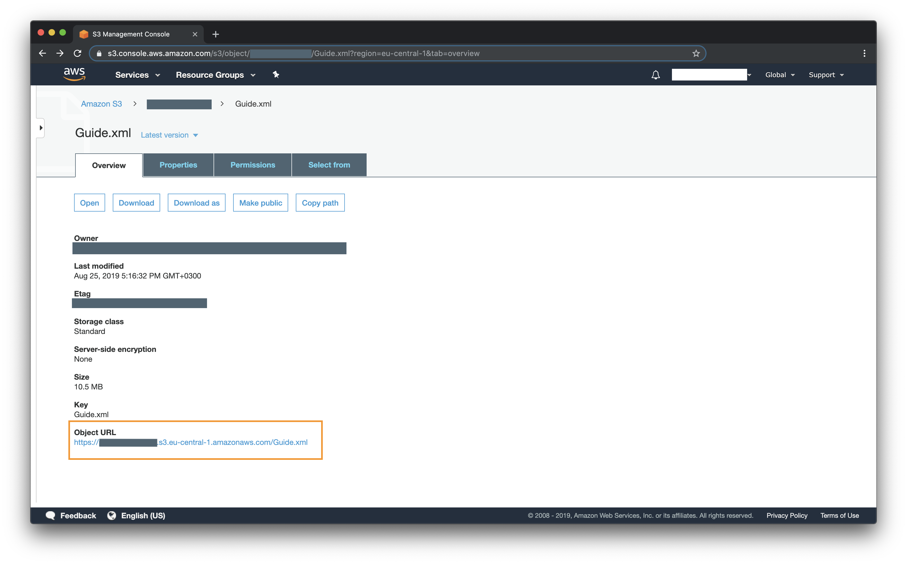

# EPG generator

Simple EPG generator wich runs on AWS (Amazon web services) lambda. Infrastructure are deployable trough [serverless framework](https://serverless.com).

Serverless Framework enables you to seemlessly deploy applications to AWS. However, this does require AWS Credentials to do so. There are a few ways to supply your credentials, preferred approach it to use the AWS CLI to configure details.

In order to use Serverless on AWS you will need an AWS Account. If you don’t already have one, you can sign up for a free trial that includes 1 million free AWS Lambda requests per month.

### Prerequest

- [Install .NET core](https://dotnet.microsoft.com/download)

- [Install the AWS CLI](https://docs.aws.amazon.com/cli/latest/userguide/cli-chap-install.html)

- [For detailed information of the aws configure check out the Configuring the AWS CLI](https://docs.aws.amazon.com/cli/latest/userguide/cli-chap-configure.html?linkCode=w61&imprToken=rIpUBadxcvuX734XP4x85Q&slotNum=1)

- Install global serverless dependencies:

```sh
npm install -g serverless
```

### Setup

1. Clone repository and go to downloaded directory.

2. Rename `env.configs.yml.example` file to `env.configs.yml` and fill it wit values:

```yaml
# Targeted deployment stage (you can leave at it is)
stage: prod
# Targeted aws region (you can leave at it is)
region: eu-central-1
# Bucket name (Bucket will be created in deployment step. Pick a unique name. Only lowercase allowed)
bucket: my-custom-epg-bucket-name
# Generated EPG file name
filename: Guide.xml
# You IPv4 address. You can find it here: https://whatismyipaddress.com/
customerExternalIpAddress: 111.111.11.11
```

3. Build application.

For Unix use command:

```sh
./build.sh
```

For Windows:

```cdm
build.cmd
```

### Deploy

1. Deploy epg generator service to AWS.

```
sls deploy
```

2. Invoke epg generator service for the first time (This step only needed for the first time, later script will run automaticly at 02:00 AM) with command:

```
sls invoke -f epgGenerator
```

3. Check if epg generator run succesfully:

```
sls logs -f epgGenerator
```

You should look for output something like:

```
START RequestId: 2f5c6c14-379d-4a46-8311-240c5ca62423 Version: $LATEST
RunTime 00:00:34.65
END RequestId: 2f5c6c14-379d-4a46-8311-240c5ca62423
REPORT RequestId: 2f5c6c14-379d-4a46-8311-240c5ca62423	Duration: 35410.07 ms	Billed Duration: 35500 ms 	Memory Size: 1024 MB	Max Memory Used: 204 MB
```

At this time you succesfully deployed service to AWS

### Find your generated epg file link

Login to you AWS account. Go to S3 service and look for your bucket (you should look for a bucket with name you wrote in environment file).


